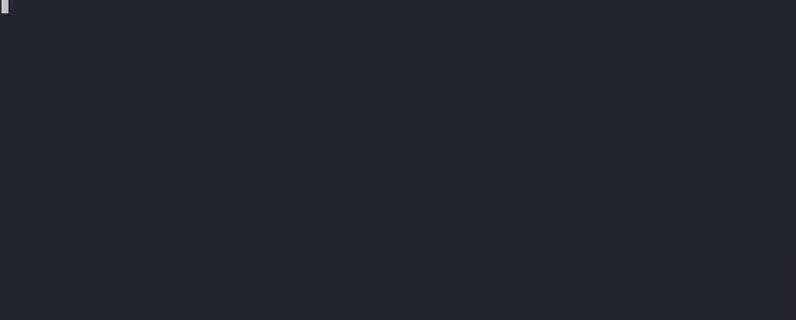
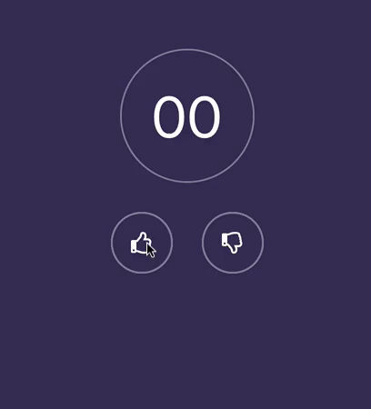

## React Starter

This is a small project that extends Creact React App and adds some of my personal preferences. Probably not the most idiomatic way to do this, but it was a good excuse to dig into how CRA works.

```
npx @johnstonbl01/react-starter
```

<p align="center">
  
  
</p>
